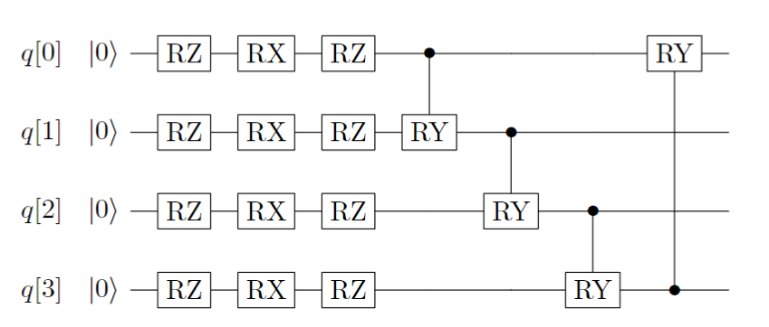
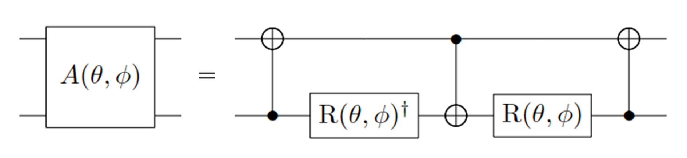

Ansatz Tutorial
=================================

In order to obtain an experimental wavefunction that closely approximates the quantum ground-state, we require a suitable wavefunction assumption, referred to as an ansatz. And theoretically, the closer the assumed trial state is to the ideal wavefunction, the more advantageous it is to obtain the correct ground-state energy later on.  In practice, when using the VQE algorithm to simulate the ground-state problem of molecular systems on a quantum computer, the process ultimately involves evolving states on the quantum computer to prepare a trial wavefunction that is closest to the actual ground state.
Finally, the minimum expected value, namely the ground-state energy, is obtained by measuring the Hamiltonian. The classical field of traditional computational chemistry has developed various methods for constructing wavefunctions, such as Configuration Interaction (CI) [1]_, Coupled Cluster Method (CC) et al. [2]_.

At present, the mainstream ansatzs applied on VQE mainly fall into two categories: one is chemically inspired ansatzs, such as Unitary Coupled Cluster (UCC) [3]_, the other type is based on the hardware characteristics of quantum computers, namely the Hardware-Efficient ansatz [4]_.
As of now, pyChemiQ supports ansatz such as Unity Coupled Cluster (UCC), Hardware-Efficient、Symmetry-Preserved [5]_ to construct quantum circuits and construct quantum circuits through customized methods, please refer to :doc:`../04advanced/circuit` in the advanced tutorial for details.

1. Constructing Circuits Using the Unitary Coupled Cluster Ansatz

When choosing the Hartree-Fock state as the initial guess wavefunction to solve the ground-state energy of the system, as the Hartree-Fock state is a single-electron configuration and does not consider the electron correlation energy, it is necessary to prepare it into a multi-electron configuration (i.e. entangled state) in order to achieve measurement results at chemical accuracy.
The CC in UCC is the Coupled Cluster operator e^t in quantum chemistry :math:`e^{\hat{T}}`, which starts from the Hartree-Fock molecular orbital and obtains the wavefunction of the real system through the exponential form of the coupling operator. The following example is the quantum circuit of the single excited operator :math:`a_2^{\dagger}a_0 - a_0^{\dagger}a_2` for hydrogen molecules.

.. image:: ./picture/UCC.png
   :align: center
   :scale: 50%
.. centered:: Figure 1: Quantum Circuit of Single Excitation Operator :math:`a_2^{\dagger}a_0 - a_0^{\dagger}a_2`

2. Constructing Circuits Using the Hardware-Efficient Ansatz

The ansatz based on the hardware characteristics of quantum computers is a commonly used ansatz in various variational quantum algorithms。 When we have limited information about the problem to be solved, we can use basic quantum gates to search for the target.
Usually, the ansatz constructed based on hardware characteristics consists of many layers, and each layer's quantum circuit consists of two parts: firstly, single-qubit rotation gates (RZRXRZ) on each qubit; secondly, controlled logic gates (controlled-RY gates) formed by two adjacent qubits entangled with each other. The single-layer quantum circuit is shown in the following figure:

.. centered:: Figure 2: Single layer quantum circuit ansatz based on Hardware-Efficient

3. Constructing Circuits Using the Symmetry-Preserved Ansatz

Based on the Symmetry-Preserved ansatz, a specific entangling gate :math:`A(\theta, \phi)` is used as the constituent unit to construct an ansatz that maintains particle number conservation, time-reversal symmetry, and spin symmetry.
On the basis of :math:`|00\rangle, |01\rangle, |10\rangle, |11\rangle`, :math:`A(\theta, \phi)` can be represented as:

.. math::
   A(\theta, \phi) = \begin{pmatrix} 1 & 0 & 0 & 0 \\ 0 & \cos \theta & e^{i\phi}\sin \theta & 0 \\ 0 & e^{-i\phi}\sin \theta & -\cos \theta & 0 \\ 0 & 0 & 0 & 1  \\ \end{pmatrix}

The entangling gate is decomposed into single-qubit and double-qubit basic gates as follows:

.. centered:: Figure 3: Decomposition of Gate :math:`A(\theta, \phi)`.  Where: :math:`R(\theta, \phi)  = R_z(\phi + \pi) R_y(\theta + \pi/2), R_z(\theta) = exp(−i \theta \sigma_z/2), R_y(\phi) = exp(−i \phi \sigma_y/2)`

The quantum circuit for the Symmetry-Preserved ansatz constructed using :math:`A(\theta, \phi)` and X gates is illustrated in the following diagram:

.. image:: ./picture/SP.png
   :align: center
   :scale: 60%
.. centered:: Figure 4: Single layer quantum circuit ansatz based on Symmetry Reserved

----------

In the code examples provided in the basic tutorial, UCCSD is used, such as calculating LiH molecules:

.. code-block::

    from pychemiq import Molecules,ChemiQ,QMachineType
    from pychemiq.Transform.Mapping import jordan_wigner,MappingType
    from pychemiq.Optimizer import vqe_solver
    from pychemiq.Circuit.Ansatz import UCC
    import numpy as np

    multiplicity = 1
    charge = 0
    basis =  "sto-3g"
    geom = ["Li     0.00000000    0.00000000    0.37770300",
            "H      0.00000000    0.00000000   -1.13310900"]
    mol = Molecules(
        geometry = geom,
        basis    = basis,
        multiplicity = multiplicity,
        charge = charge)
    fermion_LiH = mol.get_molecular_hamiltonian()
    pauli_LiH = jordan_wigner(fermion_LiH)

    chemiq = ChemiQ()
    machine_type = QMachineType.CPU_SINGLE_THREAD
    mapping_type = MappingType.Jordan_Wigner
    pauli_size = len(pauli_LiH.data())
    n_qubits = mol.n_qubits
    n_elec = mol.n_electrons
    chemiq.prepare_vqe(machine_type,mapping_type,n_elec,pauli_size,n_qubits)

    # Set the ansatz type, where UCCSD is used
    ansatz = UCC("UCCSD",n_elec,mapping_type,chemiq=chemiq)

Let's demonstrate how to use pyChemiQ to call other ansatz:

.. code-block::

    # ansatz using UCCS
    from pychemiq.Circuit.Ansatz import UCC
    ansatz = UCC("UCCS",n_elec,mapping_type,chemiq=chemiq)
    # ansatz using UCCD
    ansatz = UCC("UCCD",n_elec,mapping_type,chemiq=chemiq)

    # ansatz using HardwareEfficient
    from pychemiq.Circuit.Ansatz import HardwareEfficient
    ansatz = HardwareEfficient(n_elec,chemiq = chemiq)

    # ansatz using SymmetryPreserved
    from pychemiq.Circuit.Ansatz import SymmetryPreserved
    ansatz = SymmetryPreserved(n_elec,chemiq = chemiq)

After specifying the ansatz type, a quantum circuit with parameters can be automatically generated. The next step is to specify the classical optimizer and initial parameters and iteratively solve them:

.. code-block::

        method = "SLSQP"
        init_para = np.zeros(ansatz.get_para_num())
        solver = vqe_solver(
                method = method,
                pauli = pauli_LiH,
                chemiq = chemiq,
                ansatz = ansatz,
                init_para=init_para)
        result = solver.fun_val
        print(result)
        
The results obtained by using different ansatz with other parameters unchanged are as follows:

.. list-table::
    :align: center

    *   -   ansatz
        -   Energy(Hartree)
    *   -   UCCS
        -   -7.863382128921046
    *   -   UCCD
        -   -7.882121742611668
    *   -   UCCSD
        -   -7.882513551487563
    *   -   HE
        -   -7.8633821289210415
    *   -   SP
        -   -5.602230693394411 

Comparing with the classical Full CI result of -7.882526376869 for the same basis set, we observe that the UCCD and UCCSD ansatz have already achieved chemical accuracy of :math:`1.6\times 10^{-3}` Hartree.

**References**

.. [1]  Peter J Knowles and Nicholas C Handy. A new determinant-based full configuration interaction method. `Chemical physics letters`, 111(4-5):315–321, 1984.
.. [2]  Rodney J Bartlett. Many-body perturbation theory and coupled cluster theory for electron correlation in molecules. `Annual review of physical chemistry`, 32(1):359–401, 1981.
.. [3]  Andrew G Taube and Rodney J Bartlett. New perspectives on unitary coupled-cluster theory. `International journal of quantum chemistry`, 106(15):3393–3401, 2006.
.. [4]  Abhinav Kandala, Antonio Mezzacapo, Kristan Temme, Maika Takita, Markus Brink,Jerry M Chow, and Jay M Gambetta. Hardware-efficient variational quantum eigensolver for small molecules and quantum magnets. `Nature`, 549(7671):242–246, 2017.
.. [5]  Bryan T Gard, Linghua Zhu, George S Barron, Nicholas J Mayhall, Sophia E Economou, and Edwin Barnes. Efficient symmetry-preserving state preparation circuits for the variational quantum eigensolver algorithm. `npj Quantum Information`, 6(1):10, 2020.