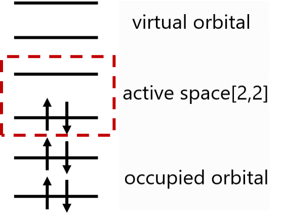

Hamiltonian Tutorial
=================================

One of the basic goals of Quantum chemistry is to unveil the relationship between molecular structure and properties. We can calculate the accurate molecular properties according to the wave-function describing the electron in the molecule, and the electronic wave-function satisfies the electron Schrödinger equation. The electronic Schrödinger equation of the system can be expressed as (1). :math:`|\psi_{el}\rangle` is the electronic wave-function of the system, :math:`\hat{H}_{el}` is the Hamiltonian of the electrons in the system，in the form of equation (2) (atomic units), where :math:`A` refers to the nucleus, and， :math:`i,j` (i,j refers to electrons.).
The first term is the kinetic energy of the electrons, and the second term represents the coulomb attraction between the electron and the nucleus. :math:`r_{Ai}` is the distance between electron :math:`i` and nucleus :math:`A` with atomic number :math:`Z_{A}`, The third term represents the repulsion between electrons, :math:`r_{ij}` is the distance between electron :math:`i` and electron :math:`j`. The solution of this equation is based on the motion of electrons around a fixed atomic nucleus, as the mass of the nucleus in the atom is much greater than that of the electron, and the motion is slower than that of the electron. So we can ignore the effect of atomic nuclei and assume that electron motion is approximated around a fixed atomic nucleus.

.. math::
    \hat{H}_{el}|\psi_{el}\rangle = E_{el}|\psi_{el}\rangle     (1)

.. math::
    \hat{H}_{el}=-\frac{1}{2} \sum_{i} \nabla_{i}^{2}-\sum_{A,i}\frac{Z_{A}}{r_{A i}}+\sum_{i>j} \frac{1}{r_{ij}}     (2)

So our core goal can be described as: solving the stationary electron Schrödinger equation in a specific molecular system, obtaining the eigenvalues of the system in different steady-state states, i.e. electron energy. According to the variational principle, the minimum eigenvalue obtained is the ground-state energy of the system :math:`E_0` (ground-state energy), The corresponding system state is ground-state.

.. math::
    E=\dfrac{\langle \psi |\hat{H}| \psi \rangle}{\langle \psi|\psi \rangle} \geq E_0

In the form of second quantization, the electron wave-function can be expressed as an occupation number state, where the orbital order increases sequentially from right to left, as shown in equation (3).
Where N is the number of electrons and M is the number of spin orbitals.When the spin orbital :math:`\chi_p` is occupied by electrons, :math:`n_p` is 1; On the contrary, when not occupied, :math:`n_p` is 0.
In other words, occupation number state is a set of binary number strings containing only 0 and 1, whose length is the number of spin orbitals, and a 1 in each bit indicates that the spin orbitals under that number are occupied.
From this, we can apply a series of creation operators to the vacuum state :math:`|\rangle` to construct the Hartree-Fock state of any system. As shown in equation (4). In the formula, :math:`a_{i}^{\dagger}` is the creation operator, its function is to generate an electron on the i-th spin orbital.
Similarly, :math:`a_{j}` is defined as the annihilation operator, and its function is to annihilate an electron on the j-th spin orbital.

.. math::
    \Phi_{HF}(\chi_1,\chi_2,\cdots,\chi_N)=|n_{M-1},n_{M-2},\cdots,n_0\rangle     (3)

.. math::
    |n_{M-1},n_{M-2},\cdots,n_0\rangle = a_0^{\dagger} a_1^{\dagger} \cdots a_N^{\dagger}|\rangle = \prod_{i=1}^N a_i^{\dagger}|\rangle     (4)

After second quantization, the Hamiltonian of the electron is expressed in the form of equation (5) [1]_, the first term in this equation is a one-body operator, the second term is a two-body operator, and the subscript :math:`pqrs` represents different electron spin orbitals, where  :math:`h_{pq}` 、 :math:`h_{pqrs}` represents single and double electron integrals, respectively. If the basis set is selected, we can determine the specific value of the integration.

.. math::
    \hat{H}_{el}=\sum_{pq} h_{pq} a_{p}^{\dagger} a_{q}+\frac{1}{2} \sum_{pqrs} h_{pqrs} a_{p}^{\dagger} a_{q}^{\dagger} a_{s} a_{r}     (5)

In pyChemiQ, you can obtain the molecular fermionic Hamiltonian using the method get_molecular_hamiltonian(). Let's take hydrogen molecules as an example to display the obtained Hamiltonian.

.. code-block::

    from pychemiq import Molecules

In the pychemiq.Molecules module, we can initialize the electronic structure parameters of molecules, including their geometry （in angstrom units）, basis set, charge, and spin multiplicity, and store molecular information in the object.
Perform classic Hartree-Fock calculation after inputting parameters.

.. code-block::

    multiplicity = 1
    charge = 0
    basis =  "sto-3g"
    geom = "H 0 0 0,H 0 0 0.74"
    mol = Molecules(
        geometry = geom,
        basis    = basis,
        multiplicity = multiplicity,
        charge = charge)

By calling get_molecular_hamiltonian(), we can obtain the molecular Hamiltonian sub-terms in Fermion form and the coefficients of each term. The following is the example code and the printed results of the fermionic Hamiltonian for hydrogen molecules.

.. code-block::

    fermion_H2 = mol.get_molecular_hamiltonian()
    print(fermion_H2)

    {
    : 0.715104
    0+ 0 : -1.253310
    1+ 0+ 1 0 : -0.674756
    1+ 0+ 3 2 : -0.181210
    1+ 1 : -1.253310
    2+ 0+ 2 0 : -0.482501
    2+ 1+ 2 1 : -0.663711
    2+ 1+ 3 0 : 0.181210
    2+ 2 : -0.475069
    3+ 0+ 2 1 : 0.181210
    3+ 0+ 3 0 : -0.663711
    3+ 1+ 3 1 : -0.482501
    3+ 2+ 1 0 : -0.181210
    3+ 2+ 3 2 : -0.697652
    3+ 3 : -0.475069
    }

In addition, pyChemiQ also supports the setting of active spaces and frozen orbitals, by limiting electrons and excited orbitals, only considering the excitation configuration where some electrons are excited to some orbitals. Proper utilization of active spaces and frozen orbitals can reduce the number of required qubits for simulation while maintaining chemical accuracy.

The active space method (CASSCF in the classic) divides molecular orbitals into three parts: occupied orbitals, active orbitals, and virtual orbitals. The electron occupying orbital always maintains electron double occupancy, while virtual orbitals are unoccupied. Limited electrons will only transition freely within the active orbitals. We define the active space [m, n], where m is the number of active orbitals and n is the number of active electrons. At this point, the calculation includes all the arrangements of n electrons on m orbitals. The selection of active orbitals is generally at the HOMO and LUMO positions, as electrons in these molecular orbitals, like valence electrons in atomic orbitals, are the most reactive electrons in chemical reactions and play a crucial role. The following figure is an example of the active space [2,2]:

.. centered:: Figure 1: Partition of molecular orbitals in active space setup

In pyChemiQ,we specify the active space in the pychemiq.Molecules module using the 'active' parameter.  For example, we specify the active space [2,2] to obtain the Hamiltonian of LiH:

.. code-block::

    multiplicity = 1
    charge = 0
    basis =  "sto-3g"
    geom = ["Li     0.00000000    0.00000000    0.37770300",
            "H      0.00000000    0.00000000   -1.13310900"]
    active = [2,2]
    mol = Molecules(
        geometry = geom,
        basis    = basis,
        multiplicity = multiplicity,
        charge = charge,
        active = active)
    fermion_LiH = mol.get_molecular_hamiltonian()

The setting of pyChemiQ for the number of frozen orbitals is specified through the 'nfrozen' parameter. By default, we start freezing the orbitals and their electrons from the lowest-energy molecular orbitals. For example, in the following example, we freeze a space orbital to obtain the Hamiltonian of LiH:

.. code-block::

    multiplicity = 1
    charge = 0
    basis =  "sto-3g"
    geom = ["Li     0.00000000    0.00000000    0.37770300",
            "H      0.00000000    0.00000000   -1.13310900"]
    nfrozen = 1
    mol = Molecules(
        geometry = geom,
        basis    = basis,
        multiplicity = multiplicity,
        charge = charge,
        nfrozen = nfrozen)
    fermion_LiH = mol.get_molecular_hamiltonian()

**References**

.. [1]  Attila Szabo and Neil S Ostlund. `Modern quantum chemistry: introduction to advanced electronic structure theory`. Courier Corporation, 2012.